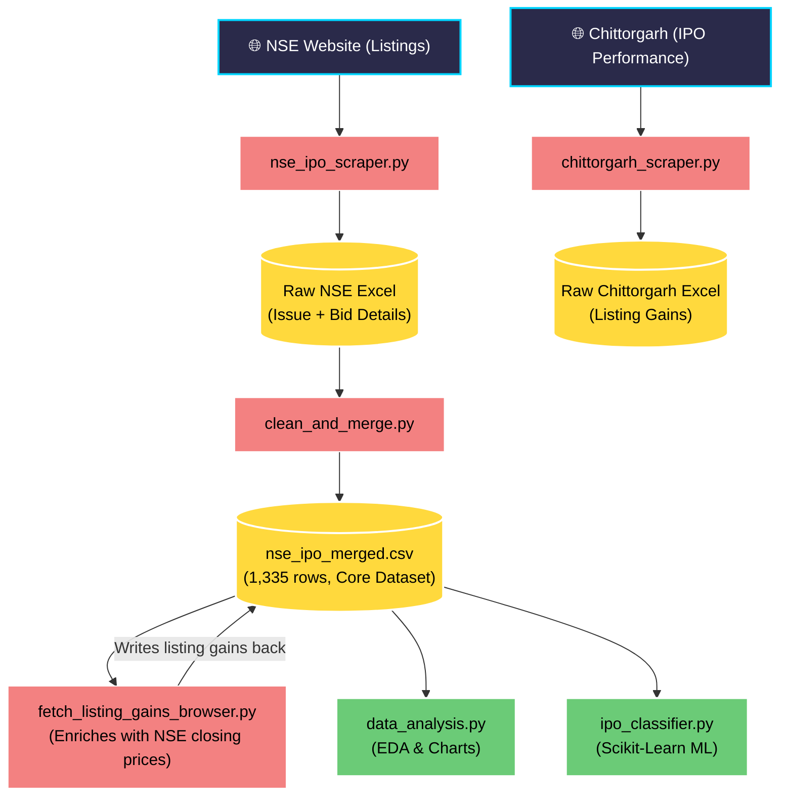
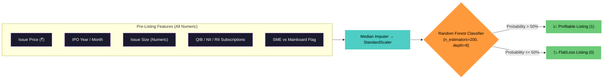

# 🧠 NSE IPO Analyzer & Predictor: Project Workflow

This document provides a high-level, visual summary of the entire end-to-end data pipeline, the machine learning classification workflow, and the key insights derived from the NSE IPO dataset (2016–2026).

---

## 🏗️ 1. Data Engineering Pipeline

The project relies on a robust data engineering pipeline that aggregates unstructured web data into a clean, machine-learning-ready dataset.

> [!NOTE]
> `chittorgarh_scraper.py` produces a standalone reference Excel file (`ipo_listing_prices_2016_2026.xlsx`) for cross-validation. It is not directly merged into the main pipeline — the primary listing gain data comes from `fetch_listing_gains_browser.py` which enriches `nse_ipo_merged.csv` with NSE closing prices.

---

## 🤖 2. Machine Learning Classifier Workflow

Our goal was to predict whether an upcoming IPO would list at a premium (Class 1) or flat/loss (Class 0) based entirely on pre-listing factors.

---

## 📊 3. Key Findings & Insights

> [!NOTE] 
> **The 2021+ Regime Shift**  
> The IPO market structurally changed after 2020. The hit rate (chance of a positive listing) skyrocketed from a dismal **32% in 2019** to an unprecedented **84% in 2024**. This fundamentally changes baseline probabilities for predictive modeling.

> [!TIP]
> **High Subscription ≠ High Returns**  
> Our analysis revealed a surprisingly weak correlation ($r \approx 0.10$) between total subscription numbers and actual listing day gains. A massively oversubscribed IPO guarantees nothing. 

> [!WARNING]
> **SME Returns vs SME Risk**  
> SME IPOs generated significantly higher average returns (+28.5%) compared to Mainboard IPOs (+9.8%). However, the variance is extreme—SMEs accounted for both the top gainers (+1,044%) and the worst crashers (-98%).

> [!IMPORTANT]
> **Sell on Listing Day**  
> Listing Day returns and First Week returns had a near-perfect correlation ($r = 0.96$). Almost all of the true price discovery happens immediately upon open, meaning holding for the first week rarely yields additional alpha.

---

## 🏆 4. Model Evaluation Results

The dataset was split chronologically: trained on the first 80% (older IPOs) and tested on the most recent 20%.

| Model | Accuracy | ROC-AUC | Pro & Con |
|-------|----------|---------|-----------|
| **Logistic Regression** | 85.2% | 0.838 | High naked accuracy in a bull market, but over-predicts wins (misses 69% of flat/loss IPOs). |
| **Random Forest** | 83.9% | 0.831 | **Winner for Risk Management**: Successfully identified 66% of loss-making IPOs while capturing 88% of winners. |
| **Gradient Boosting** | 77.8% | 0.761 | Struggled with class imbalance and noise compared to the Random Forest ensemble. |

### The 4 Most Predictive Features:
1. **Issue Price (~17%)**
2. **IPO Year (~13%)**
3. **Issue Size (~9.5%)**
4. **Retail Subscription (~9%)**
